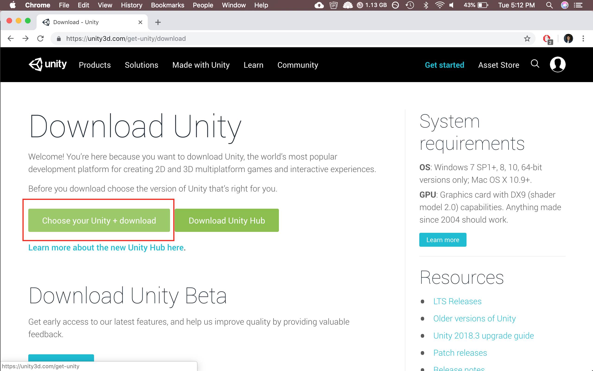
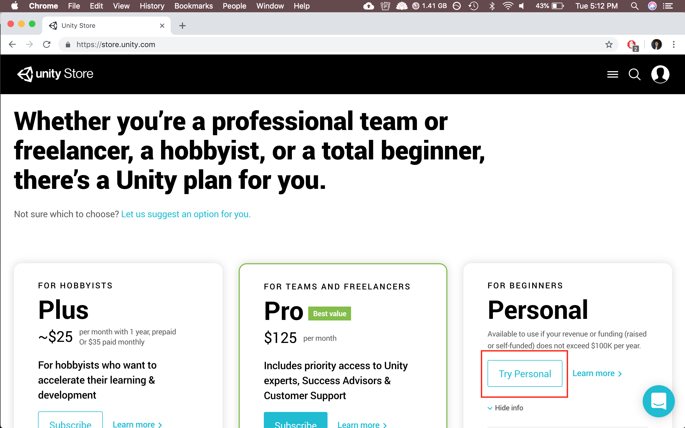
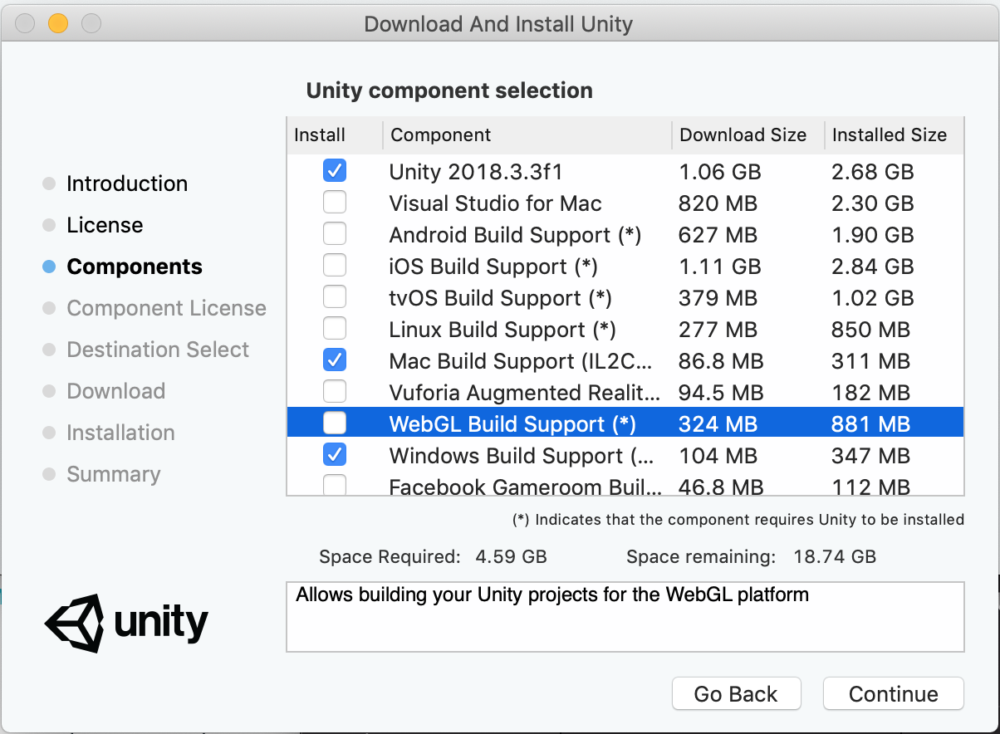
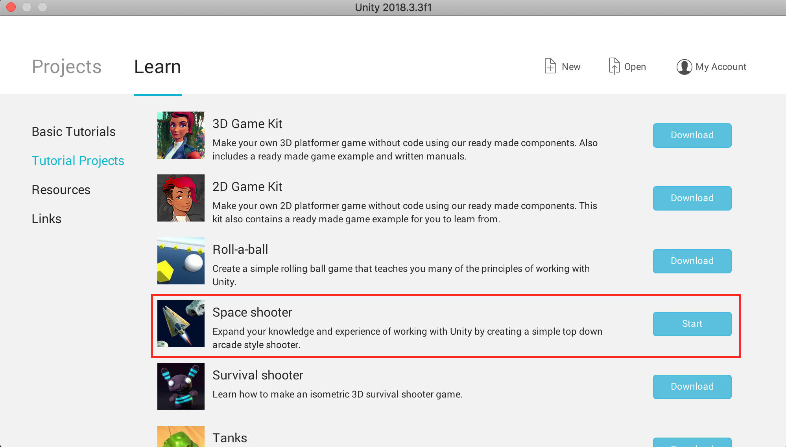

# Lesson 1: Getting to know Unity, building our player

This lesson we will be installing our key tools and learning a bit more about the engine.

## Installing Unity

Start by making a [Unity ID](https://id.unity.com/), you will need this later to use the tool

 heading to the [Unity Download Page](https://unity3d.com/get-unity/download) and click the "choose your unity + download" button.

At the next page, please select "personal edition"

Once the installer is done downloading, open it and begin the installation process by following the instructions on screen.
When prompted with the **Components** page, please select **Unity**, **Mac Build Support**, and **Windows Build Support**. You may now proceed with the rest of the installation.

## Importing our project

Once Unity is done installing, please open it and sign in with your Unity ID.
You will need to create a new project to work with our assets. You will find the tutorial project in the **Learn** tab under **Tutorial Projects**. Select this tab and scroll down until you find the **Space Shooter** project, and click **Download**.

Once the download is complete, please click start, and wait for Unity to load.

When the project is open, please **immediately** attempt to close the window, and this will prompt a dialogue box indicating whether or not you want to keep the project. Please select **Keep** and save the project to a location of your choice with a good name.

Re-open Unity and you should see your project now in the **Projects** tab, click it and it should open.

**Now you're ready to rock n' roll!!!**
